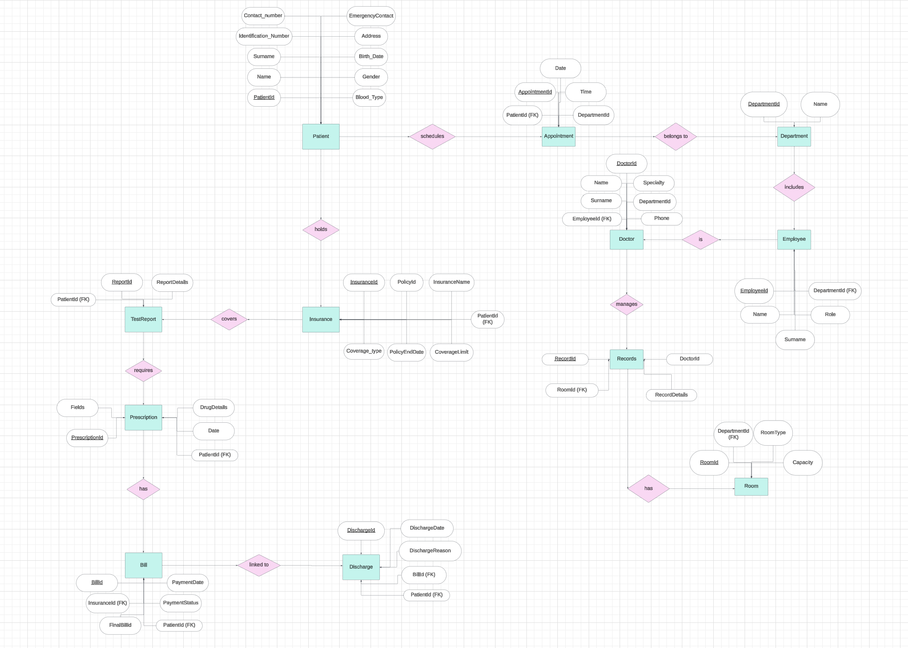
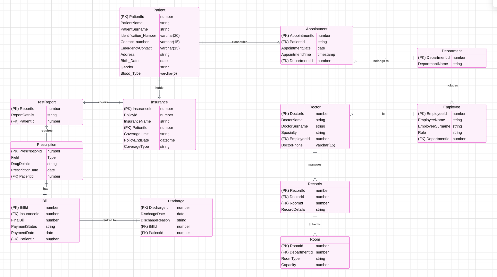

# Hospital Management Database System

# Database ER Diagram and Schema

## ER Diagram

## Relational Schema

## Table Creation and Indexes

In the Hospital Management Database System, tables are designed to store and organize data efficiently while maintaining referential integrity and consistency. The schema has been carefully developed to meet the needs of various hospital operations, such as managing patients, appointments, staff, and medical records. Each table corresponds to an entity in the system, with attributes defined to capture relevant data. Relationships between entities are maintained through foreign key constraints, ensuring that data remains interconnected and logically structured.

Unique keys for all tables are defined using the `GENERATED BY DEFAULT AS IDENTITY` clause. This approach automates the creation of unique identifiers for each record, ensuring data consistency and eliminating the need for manual key assignment. By leveraging this feature, the system reduces the likelihood of errors such as duplicate or missing keys while simplifying data insertion processes.

Indexes play a crucial role in optimizing database performance. By automatically creating indexes on primary and foreign keys, the system ensures faster query execution, particularly for operations involving relationships and lookups. Custom indexes can be added later based on specific use cases or frequent query patterns.

---

## Data Entry, Update, and Deletion with Procedures

The `Hospital_Management_Pkg` package is a comprehensive collection of stored procedures designed to handle key operations within the Hospital Management Database System. It centralizes and simplifies the management of various entities, including departments, rooms, employees, doctors, patients, appointments, and more. Each procedure in the package is tailored to perform Create, Read, Update, and Delete (CRUD) operations, ensuring consistent and efficient data manipulation across the system.

By encapsulating these operations into a package, the system achieves modularity, making it easier to maintain and extend. For instance, procedures such as `Insert_Department`, `Update_Patient`, and `Delete_Appointment` abstract complex SQL operations into reusable and callable methods, reducing redundancy and potential errors. Furthermore, the use of procedures ensures data integrity by adhering to relational constraints like foreign keys and references.

After implementing the package, data entry, updates, and deletions were carried out to test the functionality of the procedures. These tests confirmed the successful execution of the CRUD operations, validating the reliability and correctness of the package. The addition, removal, and updating of records in the database showcased the seamless integration of the procedures with the database schema, ensuring efficient and error-free data handling.

---

## Dynamic PL/SQL Report

Dynamic PL/SQL reporting provides a flexible and efficient mechanism for generating tailored reports in the Hospital Management Database System. By leveraging dynamic query construction and `SYS_REFCURSOR`, it allows users to retrieve data based on specific conditions and parameters at runtime. This approach eliminates the need for predefined static queries, making the system highly adaptable to various reporting needs.

Dynamic reports are utilized to query and display information across different entities, such as departments, patients, appointments, and medical records, ensuring that users can access relevant data quickly and accurately. This flexibility enhances decision-making, supports operational requirements, and simplifies the reporting process for administrators and staff.

---

## 3rd Normal Form Analysis

### 1. First Normal Form (1NF)
To ensure the database satisfies 1NF, each column must contain atomic (indivisible) values, and every row must be unique. Additionally, each table should have a primary key.

**Analysis:**
- All columns store atomic values, and no multi-valued attributes or repeating groups were detected.
- Each table has a primary key, ensuring unique rows.

**Conclusion:**
The database satisfies 1NF requirements.

### 2. Second Normal Form (2NF)
2NF requires the database to first satisfy 1NF and for all non-primary key attributes to be fully dependent on the entire primary key (with no partial dependencies).

**Analysis:**
- Non-primary key attributes in all tables are fully dependent on their respective primary keys.
- No partial dependencies were detected, as there are no composite primary keys.

**Conclusion:**
The database satisfies 2NF requirements.

### 3. Third Normal Form (3NF)
3NF requires the database to first satisfy 2NF, with no transitive dependencies (attributes must depend directly on the primary key).

**Analysis:**
- All attributes are directly dependent on their primary keys without intermediary attributes.

**Conclusion:**
The database satisfies 3NF requirements.

**Validation:**
- SQL queries were used to confirm compliance with 1NF, 2NF, and 3NF.
- Atomicity is maintained, no partial dependencies exist, and there are no transitive dependencies.

---

## Remove Duplicates

The `Remove_Duplicates` procedure in the Hospital Management Database System is designed to identify and eliminate duplicate records from tables based on specified key columns. Initially, duplicate entries were deliberately inserted into tables such as Patient, Employee, Room, and Insurance to simulate real-world scenarios where duplicate data might arise due to user errors or system issues.

Using the `Remove_Duplicates` procedure, duplicates were successfully removed dynamically. The procedure constructs a SQL query that retains only the first occurrence of each record (based on the `ROWID`) while removing subsequent duplicates identified by the key columns.

For example:
- In the Patient table, duplicates were identified and removed using the `Identification_Number` column.
- In the Insurance table, duplicates were detected based on the combination of `PolicyId`, `InsuranceName`, and `PatientId`.

**Results:**
- Duplicate records were successfully removed, ensuring data integrity and preventing redundancy.
- Audit logs were examined to track the changes made during the removal process, ensuring transparency and traceability.

---

This documentation highlights the structure, features, and functionalities of the Hospital Management Database System, emphasizing its robust design, normalized schema, and efficient data handling mechanisms.

